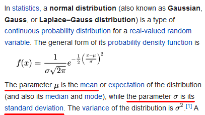

```{r setup, include=FALSE}
knitr::opts_chunk$set(echo = FALSE)
```

## The Normal Distribution

The Normal Distribution is basically a curve that looks like a bell. Here's a picture.

```{r}
curve(dnorm(x), from = -3, to = 3, ylab = "")
```

## The Normal Distribution

The mean is the top of the hump (red line). The standard deviation is the _inflection point_, where the curve goes from _concave down_ to _concave up_ (blue lines). It measures spread. Below we see the mean is 0 and the standard deviation is 1.

```{r}
curve(dnorm(x), from = -3, to = 3, ylab = "")
abline(v = 0, col = "red")
abline(v = 1, col = "blue")
abline(v = -1, col = "blue")
```

## The Normal Distribution

The mean and standard deviation are like dials or controls on a machine. Changing the mean moves the curve _left and right_. Changing the standard deviation makes the curve _skinny or wide_.

```{r}
op <- par(mfrow = c(2,2))
curve(dnorm(x, mean = 0, sd = 1), from = -6, to = 6, ylab = "", main = "mean = 0; sd = 1", ylim = c(0,0.4))
curve(dnorm(x, mean = 0, sd = 2), from = -6, to = 6, ylab = "", main = "mean = 0; sd = 2", ylim = c(0,0.4))
curve(dnorm(x, mean = 2, sd = 1), from = -6, to = 6, ylab = "", main = "mean = 2; sd = 1", ylim = c(0,0.4))
curve(dnorm(x, mean = 2, sd = 2), from = -6, to = 6, ylab = "", main = "mean = 2; sd = 2", ylim = c(0,0.4))
par(op)
```

## The Normal Distribution

Since the mean and standard deviation completely determine the shape of the curve, we call them _parameters_. Statisticians use the Greek symbols $\mu$ (mu) to represent the mean and $\sigma$ (sigma) to represent the standard deviation. 

Here's the formula to draw the line from the Normal distribution [Wikipedia article](https://en.wikipedia.org/wiki/Normal_distribution). There is nothing "Normal" about it! It looks pretty terrible! Fortunately, unless you teach a statistics class, you don't need to remember it.



## The Normal Distribution is a probability distribution

Calling the Normal distribution a _probability distribution_ means the area under the curve is equal to 1, or 100%. 


## Why do we care about the Normal distribution?

Take a look at this histogram of the heights of 250 randomly sampled US males. Most people are between 65 and 75 inches tall. Does the shape look familiar?

```{r}
set.seed(1)
heights <- rnorm(n = 250, mean = 69, sd = 3)
hist(heights, freq = FALSE)
```

## The Normal distribution is a good approximation 

If we take the mean and standard deviation of our data sample, we can use those values as parameters in a Normal distribution and draw a smooth curve to _approximate_ the distribution.


```{r}
hist(heights, freq = FALSE)
curve(dnorm(x, mean = mean(heights), sd = sd(heights)), 
      from = 60, to = 80, add = TRUE)

```

## Using the Normal distribution

Now we can use the Normal distribution to answer questions such as "what is the probability a randomly selected US male is taller than 6 feet 4 inches (76 inches)?" That's the area under the curve to the right of 76 inches, the area below colored blue.

```{r message=FALSE}
library(mosaic)
plotDist("norm", mean = mean(heights), sd = sd(heights), 
         groups = x > 76, type="h", col=c("wheat1", "blue"))

```


## Using the Normal distribution

R makes is pretty easy to find the area under the normal curve with the `pnorm()` function. By default it finds area to the _left_ of the value you give it. To go to the right, specify `lower.tail = FALSE`. Notice we use the `mean()` and `sd()` functions to find the mean and standard deviation of our data.

```{r echo=TRUE}
pnorm(76, mean = mean(heights), sd = sd(heights), lower.tail = FALSE)
```

0.008 rounds to about 0.01, or 0.01 $\times$ 100 = 1%. It appears there's about a 1% chance (1 in 100) that a randomly selected US male will be taller than 6 feet 4 inches.

## Simulating data from a Normal distribution

I didn't really sample 250 US males and measure their heights. Instead I randomly sampled values from a Normal distribution with mean 69 inches and standard deviation 3 inches. I did that in R using the `rnorm()` function as follows. (The `set.seed(1)` code ensures you and I generate the same "random" data. Change the 1 to another positive integer and you'll get another random set of data.)

```{r echo=TRUE}
set.seed(1)
heights <- rnorm(n = 250, mean = 69, sd = 3)
```

## Data Transformations

Sometimes we transform data to another scale. For example, converting pounds to kilograms. (1 pound = 0.453592 kg) Below is plot of kg versus pounds. Notice how the _distance_ between 20 and 40, and 80 and 100, are _the same on both scales_. This is a _linear_ transformation. 

```{r}

pounds <- 1:100
kg <- pounds * 0.453592
plot(pounds, kg, type = "l", main = "pounds vs kilograms")
segments(x0 = 20, y0 = 0, x1 = 20, y1 = kg[20], col = "red")
segments(x0 = 40, y0 = 0, x1 = 40, y1 = kg[40], col = "red")
segments(x0 = 0, y0 = kg[20], x1 = 20, y1 = kg[20], col = "red")
segments(x0 = 0, y0 = kg[40], x1 = 40, y1 = kg[40], col = "red")

segments(x0 = 80, y0 = 0, x1 = 80, y1 = kg[80], col = "red")
segments(x0 = 100, y0 = 0, x1 = 100, y1 = kg[100], col = "red")
segments(x0 = 0, y0 = kg[80], x1 = 80, y1 = kg[80], col = "red")
segments(x0 = 0, y0 = kg[100], x1 = 100, y1 = kg[100], col = "red")

```


## Data Transformations

Sometimes the transformation is _non-linear_. A common non-linear transformation is the **log transformation**. A log transformation is the power we raise the constant $e$ to get the original number. What power do we raise, or _exponentiate_, $e$ to get 1000?

```{r echo=TRUE}
log(1000)
```

The constant e is about 2.71828. If we exponentiate $e$ by `r log(1000)` we get 1000. 

```{r echo=TRUE}
2.71828^6.907755
```

Or close to it, within rounding error. The constant $e$ is an irrational number, like $\pi$, which means its decimals never end and never repeat. The details on how $e$ is derived and why it is important go beyond the scope of these slides, but [read more](https://www.mathsisfun.com/numbers/e-eulers-number.html) if you like.

## The log transformation

Below is a plot of the values 1 - 500 and their log transformed values. Notice how the _distance_ between 50 and 100, and 400 and 500, are _NOT the same on both scales_. For example, the distance between 400 and 500 is much smaller on the log scale. This is a _non-linear_ transformation. 

```{r}
x <- seq(1,500, length.out = 300)
log_x <- log(x)
plot(x, log_x, type = "l")
segments(x0 = 50, y0 = 0, x1 = 50, y1 = log(50), col = "red")
segments(x0 = 100, y0 = 0, x1 = 100, y1 = log(100), col = "red")
segments(x0 = 0, y0 = log(50), x1 = 50, y1 = log(50), col = "red")
segments(x0 = 0, y0 = log(100), x1 = 100, y1 = log(100), col = "red")

segments(x0 = 400, y0 = 0, x1 = 400, y1 = log(400), col = "red")
segments(x0 = 500, y0 = 0, x1 = 500, y1 = log(500), col = "red")
segments(x0 = 0, y0 = log(400), x1 = 400, y1 = log(400), col = "red")
segments(x0 = 0, y0 = log(500), x1 = 500, y1 = log(500), col = "red")

```

## The log transformation

The log transformation is sometimes useful for transforming skewed data to be more symmetric. This can help with statistical analyses. It spreads out values squished together and brings outlying values closer to the rest of the data. 

```{r}
op <- par(mfrow = c(1,2))
og <- rlnorm(1000)
hist(og, main = "raw data")
ogl <- log(og)
hist(ogl, main = "log transformed data")
par(op)
```

